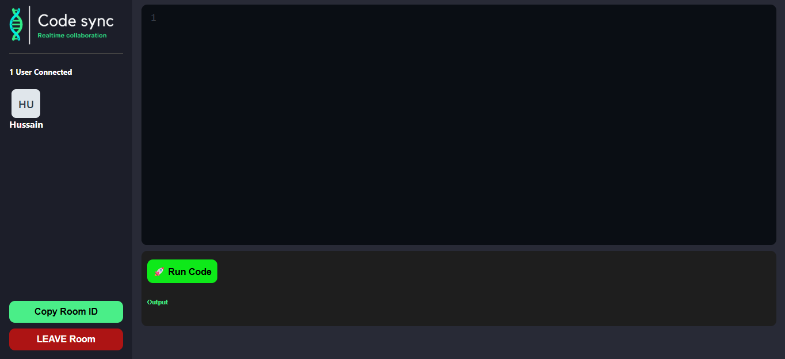

# 🧑‍💻 Real-Time Collaborative JavaScripts Code Editor 

A real-time collaborative code editor built with **React**, **Socket.IO**, **Node.js**, and **Express**. Users can write and run JavaScript code together, see who is typing, get code output in real-time, and even receive AI code suggestions.

---

## 🚀 Features

* 🧑‍🥝 Real-time collaboration
* ✨ See who is typing
* 🧠 AI-based code suggestion (free, no API key needed)//Temporary Disable or under Development
* 📄 Instant code sync
* 💻 Terminal-style code output
* 👥 Show connected users
* 🗌 Copy Room ID & share with others
* ⚡ Smooth UI with CodeMirror
* 👨‍💻 Instant code output for all users real-time
* ⌨️ Press "Ctrl+Space" together to get hints
* ⌨️ Press "Shift+Enter" together to Run Code
* 👥 All connected users notified when someone Join or Leave the Room

---

## 🖼️ Preview




---

## 🛠️ Technologies Used

* React
* CodeMirror
* Node.js
* Express
* Socket.IO
* Railway (for deployment)

---

## 📁 Project Structure

```
├── .gitignore
├── README.md
├── package-lock.json
├── package.json
├── public
    ├── AppPreview_1.png
    ├── AppPreview_2.png
    ├── code-sync.png
    ├── favicon.ico
    ├── index.html
    ├── logo192.png
    ├── logo512.png
    ├── manifest.json
    └── robots.txt
├── server.mjs
└── src
    ├── Actions.js
    ├── App.css
    ├── App.js
    ├── App.test.js
    ├── Pages
        ├── EditorPage.js
        └── Home.js
    ├── components
        ├── Client.js
        └── Editor.js
    ├── index.css
    ├── index.js
    ├── logo.svg
    ├── reportWebVitals.js
    ├── setupTests.js
    └── socket.js
```

---

## 🔧 Setup Instructions

### 1. Clone the Repository

```bash
git clone https://github.com/MrMuhammadHussain/real-time-code-editor.git
cd real-time-code-editor
```

### 2. Install Dependencies

```bash
npm install
```

Or if using Yarn:

```bash
yarn
yarn add
```

### 3. Set Environment Variable

Create a `.env` file at root Folder:

```env
REACT_APP_BACKEND_URL="http://localhost:5080/"
```

### 4. Run the App (Development)

```bash
# For frontend

npm run fornt

# For backend

npm run server:dev
```
---

## 🌍 Live App

🔗 [https://realtime-codeeditor.up.railway.app/](https://realtime-codeeditor.up.railway.app/)

---

## ⚠️ Known Issues

* `eval()` is used to run code (JavaScript only). Avoid running unsafe code.
* React 19+ may conflict with some libraries like `react-avatar`. Use alternatives like `avvvatars-react`.
* 🖥️ It's compatible with desktop
* 📱 to use in mobile rotate the phone or use desktop site version

---

## 🙌 Credits

This project was made by **\[Me]** based on a tutorial, with additional features added manually (AI suggestions, typing status, code output, how many users are connected, code hints, etc.).

---

## 📄 License

This project is open-source and available under the MIT License

---
